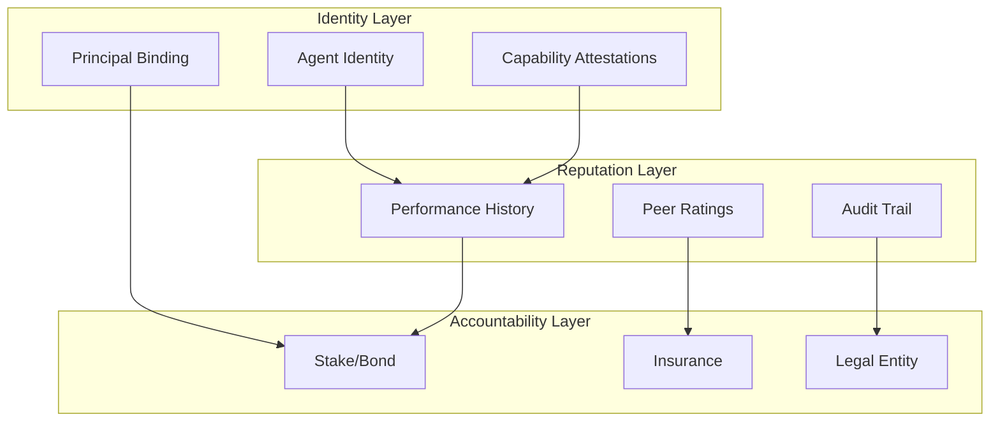
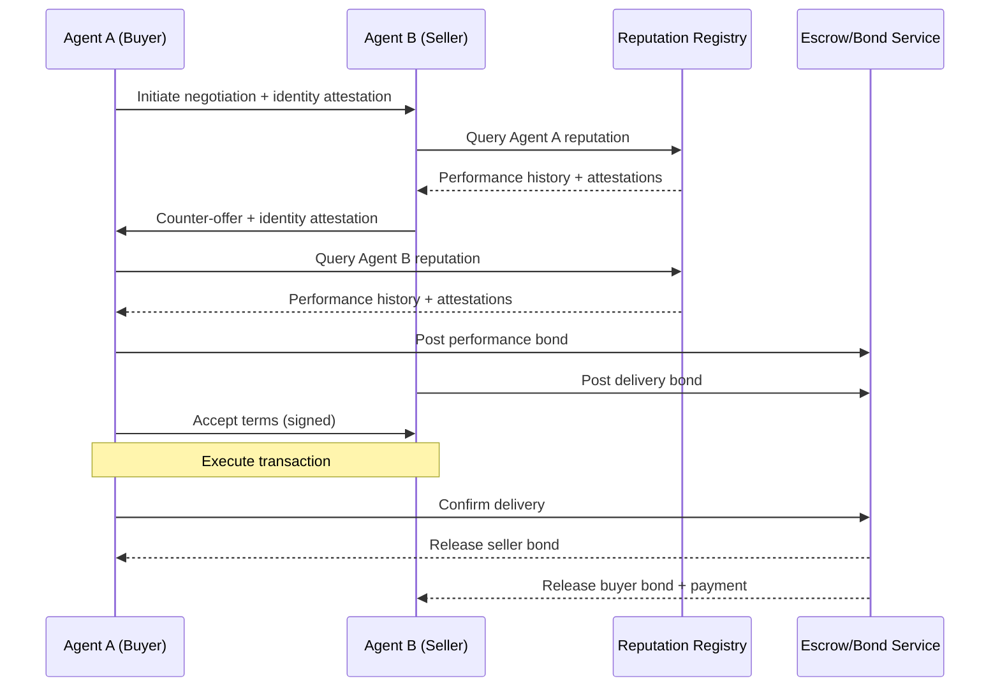

When agents start doing real work in the economy - not just answering questions but negotiating contracts, making purchases, and entering commitments on behalf of principals - we'll discover that our infrastructure assumes humanity. Credit checks, business references, contract law, reputation systems: all of it presumes a person or registered entity on the other side. We need a **trust stack** for agents.

## The problem: agents without provenance

Today's agent deployments treat trust as inherited. Your agent speaks with your authority, draws on your credit, and binds you legally. That works when agents are extensions of human intent, like a really good email client. It breaks when:

- Agents negotiate with other agents (whose principal do you trust?)
- Agents operate semi-autonomously with budget authority
- Agents interact with third parties who need to verify capabilities
- Agents make representations that might create liability

The question isn't whether agents should have trust properties - they already do, implicitly. The question is whether we'll make those properties **explicit, verifiable, and enforceable** before the gaps cause serious harm.

## What a trust stack needs

I think of trust infrastructure in three layers: **identity** (who is this?), **reputation** (should I trust them?), and **accountability** (what happens if they breach?). Each layer requires different primitives.



### Layer 1: Identity

An agent needs a stable, verifiable identity that answers: *Who operates this agent? What can it do? What constraints is it under?*

**Principal binding** is the foundation. Every agent acts on behalf of someone - a person, company, or (eventually) another agent. That relationship should be cryptographically verifiable. Not "this agent claims to represent Acme Corp" but "here is a signed attestation from Acme Corp delegating these specific authorities to this agent."

**Capability attestations** describe what an agent can do, verified by third parties. Think of them like professional certifications: "This agent has passed evals for contract negotiation in the SaaS procurement domain with a 94% accuracy score, attested by [Evaluator]." Capabilities could include:

- Domain competence (legal, financial, technical)
- Safety certifications (guardrails verified by auditor)
- Budget authority levels
- Permitted action types

**Instance identity** distinguishes this specific agent from others with the same base model. Two GPT-4 agents might have radically different training, system prompts, and safety properties. The identity layer needs to capture this.

### Layer 2: Reputation

Identity says who you are; reputation says whether to trust you. Agent reputation will likely evolve from three sources:

**Performance history** is the richest signal. Did the agent complete its tasks? Were outcomes as promised? Were costs within bounds? If we log agent actions with enough structure (and the evidence ledger I've written about before), we can compute reputation from real outcomes.

```yaml
# Sketch: reputation attestation from a completed engagement
agent: "acme-procurement-agent-v3"
engagement_id: "eng_2026_001"
principal: "acme-corp"
counterparty: "vendor-xyz"
outcome:
  completed: true
  terms_met: true
  disputes: 0
  cost_variance: -3.2%  # under budget
  counterparty_rating: 4.7/5
attested_by: "deal-platform-abc"
timestamp: "2026-02-01T14:32:00Z"
signature: "..."
```

**Peer ratings** come from other agents and humans who've interacted with this agent. Was it responsive? Did it honour commitments? Did it escalate appropriately? These subjective signals complement objective outcomes.

**Audit trails** provide the evidence behind reputation claims. A high reputation score without an inspectable trail is just a number. The audit trail lets counterparties verify: *show me the last 10 engagements and their outcomes*.

### Layer 3: Accountability

Reputation helps with the question "will they perform?" Accountability addresses "what if they don't?"

**Stake or bond** creates skin in the game. An agent (or its principal) posts collateral that can be slashed for breach. This is familiar from security deposits and performance bonds; the novelty is making it programmatic and proportional to the commitment.

**Insurance** transfers risk to specialised underwriters. Imagine agent liability insurance: "This agent is covered up to £100k for errors in financial recommendations, underwritten by [Insurer]." The insurer's willingness to cover becomes a trust signal in itself.

**Legal entity** provides the ultimate backstop. If an agent causes harm, there must be a person or registered entity accountable. For now, that's always the principal. Eventually, we might see new entity types designed for agent operations - but the principle remains: someone is liable.

## How this changes agent-to-agent interactions

When two agents negotiate, each should be able to:

1. **Verify identity**: confirm the counterparty's principal and delegated authorities
2. **Check reputation**: query performance history and attestations
3. **Assess accountability**: understand what recourse exists if things go wrong

This transforms negotiation. Today, agents mostly operate in walled gardens with implicit trust. Tomorrow, agents from different organisations will need to establish trust dynamically, perhaps even building it over multiple interactions.



## The bootstrapping problem

New agents have no reputation. How do they enter the economy?

**Principal inheritance**: A new agent starts with its principal's reputation as a floor. Acme Corp's new procurement agent is implicitly trusted because Acme Corp is trusted.

**Sandboxed trials**: New agents operate in limited contexts - small transactions, reversible actions, high oversight - until they build a track record.

**Third-party certification**: Evaluators attest to agent capabilities before deployment. This creates initial reputation from testing rather than production.

**Stake as substitute**: An agent with no reputation can post a larger bond, compensating for uncertainty with skin in the game.

## Implementation notes

This isn't entirely speculative. The building blocks exist:

- **Decentralised identity** standards (DIDs, Verifiable Credentials) can represent agent identity and attestations
- **Cryptographic signatures** can bind agents to principals and verify attestations
- **Smart contracts** can hold bonds and execute slashing conditions
- **Existing APIs** (trade references, credit checks) can inform initial reputation

The missing piece is **coordination**: agreeing on schemas, trust anchors, and dispute resolution. This is a classic standards problem. Someone needs to propose a minimal viable trust stack and get adoption.

## What this enables

With trust infrastructure, agents can:

- **Transact across organisational boundaries** without pre-existing relationships
- **Build reputation over time** that follows them across platforms
- **Operate with proportional autonomy** - more trust, more authority
- **Enter binding commitments** with enforceable consequences

The economy gets more efficient because agent-to-agent friction drops. The risks get more manageable because accountability is built in, not bolted on.

## Open questions

**Who operates the reputation registries?** Centralised registries create power concentrations and single points of failure. Decentralised approaches face adoption and coordination challenges. Probably both will coexist: platform-specific registries for closed ecosystems, federated or decentralised registries for open agent-to-agent commerce.

**How do we handle adversarial behaviour?** Reputation systems are gameable. Sybil attacks, fake transactions, reputation laundering - all the pathologies of human reputation systems will apply to agents, perhaps faster. The accountability layer (bonds, insurance, legal entities) provides backstops, but the reputation layer needs robust anti-gaming mechanisms.

**What's the liability model?** When an agent causes harm, who pays? The principal, certainly - but what about the model provider, the platform, the reputation attestor who vouched for a bad agent? These questions will be answered in courts and contracts over the next decade.

**How much reputation is enough?** Trust is contextual. The reputation needed to book a restaurant differs from the reputation needed to negotiate a million-pound contract. The trust stack needs to support proportional trust - lightweight checks for low-stakes interactions, deep verification for high-stakes ones.

## A thesis

The bottleneck for agent autonomy isn't capability - it's trust. We can build agents that negotiate, transact, and commit. We can't yet verify that an unknown agent is safe to do business with. The trust stack is the infrastructure that unlocks agent-to-agent commerce at scale.

The companies that build this infrastructure - the agent identity providers, reputation aggregators, and accountability underwriters - will be as important to the agent economy as credit bureaus and payment networks are to the current one.

---

**Bottom line:** Agents need identity to be known, reputation to be trusted, and accountability to be safe. Build the trust stack, and you unlock economic relationships between agents that we can't yet imagine. Leave it missing, and agents stay in walled gardens, forever borrowing their principals' trust instead of earning their own.
